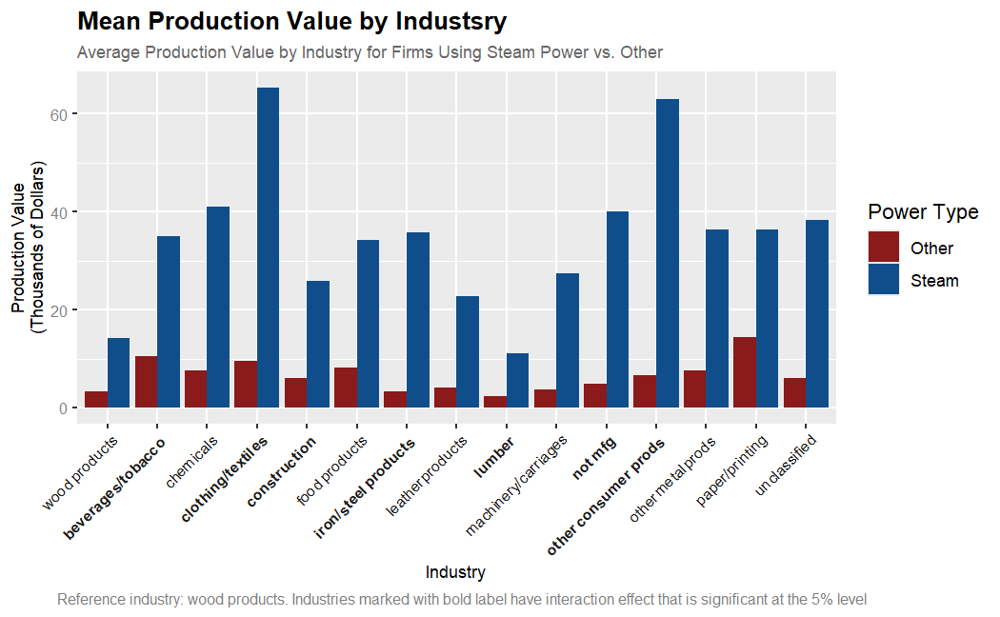
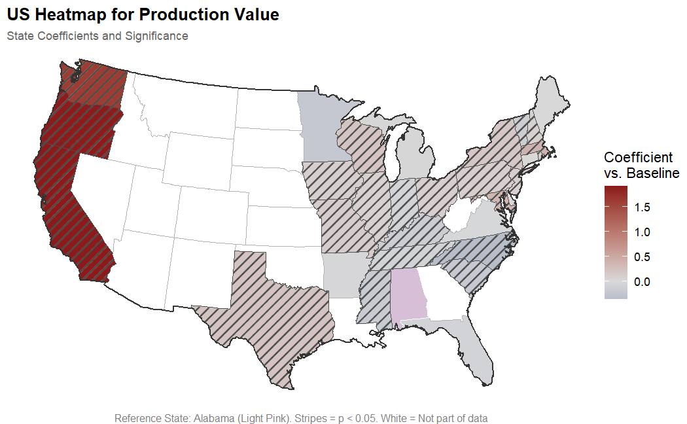

# Steam Power & Manufacturing Productivity — 1850 Census of Manufactures

**ECON 314 | St. John Fisher University**  
Evan Scheuermann, Jack Higman, Molly DeLeo

> **Status:** In progress — formal academic write-up forthcoming. 
> Regression analysis and visualizations complete.

## Overview

During the mid-19th century, the U.S. was transitioning from an agricultural 
to a manufacturing economy. Steam power was one of the most transformative 
technologies of this period, but its effects were far from uniform across 
regions and industries. This project uses the 1850 Census of Manufactures 
microdata to quantify the relationship between steam power adoption and 
manufacturing productivity at the firm level.

**Research Question:** To what extent did the transition to steam power drive 
the rapid increase in manufacturing productivity during this period, and how 
did its effect vary across regions and industries?

## Data

- **Source:** Hornbeck, R., Hsu, S. H.-M., Humlum, A., & Rotemberg, M. (2025).
  Gaining steam: Technology diffusion with recurring lock-in.
  Historical Census of Manufactures Microdata. https://cmfdata.org
- **Size:** 124,860 firms across 33 states and 15 industries
- **Key variables:**
  - `prod_val` — total annual value of goods produced (thousands of dollars)
  - `steam` — dummy variable indicating steam power use (6.8% of firms)
  - `capital` — total capital investment including real estate and equipment
    (thousands of dollars)
  - `state` — state of primary operation
  - `industry` — primary business category (15 categories)

**Preprocessing:**
- Log-transformed `capital` and `prod_val` to address right skew and enable
  percent-change interpretation of coefficients
- Checked for multicollinearity among numeric variables
- Removed non-predictive identifiers

## Model

$$\log(\text{prod\_val}) = \beta_0 + \beta_1(\text{steam}) + \beta_2\log(\text{capital}) + \beta_3(\text{state}) + \beta_4(\text{industry}) + \beta_5(\text{steam} \times \text{industry}) + \mu$$

State and industry fixed effects are included to isolate the effect of steam 
power from confounding geographic and sectoral factors. The steam × industry 
interaction term captures heterogeneous effects of steam adoption across 
different industries.

## Results

| Variable         | Estimate | Std. Error | Significance |
|------------------|----------|------------|--------------|
| steam            | 0.452    | (0.043)    | ***          |
| log(capital)     | 0.574    | (0.002)    | ***          |
| state FEs        | —        | —          | Some sig. at 5% |
| industry FEs     | —        | —          | All sig. at 5%  |
| steam × industry | —        | —          | Some sig. at 5% |

**R² = 0.516 | F-statistic = 2,148.09 (df = 62; 124,797)**  
*Reference category: Alabama (state), wood products (industry)*

### Key Findings

- Holding all else constant, steam-powered firms produced approximately **46%
  more** than non-steam counterparts
- A 1% increase in capital investment corresponded to a 0.574 increase in
  production value, making capital the strongest predictor
- Steam had a significant interaction effect with **half of the included
  industries**, with particularly strong effects in textiles, construction,
  and iron/steel
- West coast states (CA, OR, WA) showed dramatically higher coefficients,
  likely reflecting the economic expansion driven by the California Gold Rush

## Visualizations

### Mean Production Value by Industry (Steam vs. Other)

Industries with bold labels have a statistically significant steam × industry 
interaction effect at the 5% level. Reference industry: wood products.

### State Fixed Effects — US Heatmap

Choropleth map of state fixed-effect coefficients relative to Alabama baseline.
Hatching indicates significance at the 5% level. White = not in dataset.

## Tools & Packages

- **Language:** R
- **Packages:** `ggplot2`, `sf`, `ggpattern`, `stargazer`, `tidyverse`

## Files

- `Group-Project.Rmd` — Full analysis with code and narrative
- `Group-Project.pdf` — Rendered report
- `Steam-and-Manufacturing-Poster.pdf` — Final poster presentation
- `figures/` — Output visualizations

## Contributors

- Evan Scheuermann — research question design, data cleaning, regression
  modeling, state fixed effects, choropleth and industry visualizations,
  poster design
- Jack Higman
- Molly DeLeo

## Reference

Hornbeck, R., Hsu, S. H.-M., Humlum, A., & Rotemberg, M. (2025). Gaining 
steam: Technology diffusion with recurring lock-in. Historical Census of 
Manufactures Microdata. https://cmfdata.org
